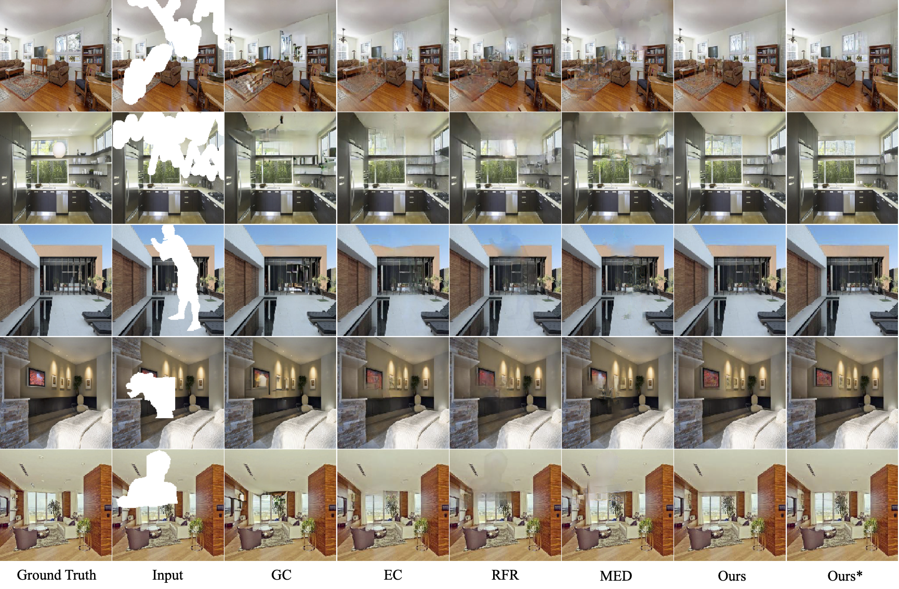

# Learning a Sketch Tensor Space for Image Inpainting of Man-made Scenes (ICCV 2021)

[Chenjie Cao](https://github.com/ewrfcas),
[Yanwei Fu](http://yanweifu.github.io/)

[](https://github.com/ewrfcas/MST_inpainting/blob/main/LICENSE)


[arXiv](https://arxiv.org/abs/2103.15087) | [Project Page](https://ewrfcas.github.io/MST_inpainting/)


## Overview

We learn an encoder-decoder model, which encodes a Sketch Tensor (ST) space consisted of refined lines and edges. 
Then the model recover the masked images by the ST space. 

### News
- [x] Release the inference codes.
- [x] Training codes.

**Now, this work has been further improved in [ZITS](https://github.com/DQiaole/ZITS_inpainting) (CVPR2022)**.

[comment]: <> (- [ ] Release the GUI codes.)

### Preparation
1. Preparing the environment. 
2. Download the pretrained masked wireframe detection model [LSM-HAWP](https://drive.google.com/drive/folders/1yg4Nc20D34sON0Ni_IOezjJCFHXKGWUW?usp=sharing) (retrained from [HAWP CVPR2020](https://github.com/cherubicXN/hawp)).
3. Download weights for different requires to the 'check_points' fold. 
   [P2M](https://drive.google.com/drive/folders/1uQAzfYvRIAE-aSpYRJbJo-2vBiwit0TK?usp=sharing) (Man-made Places2), 
   [P2C](https://drive.google.com/drive/folders/1td0SNBdSdzMdj4Ei_GnMmglFYOgwUcM0?usp=sharing) (Comprehensive Places2), 
   [shanghaitech](https://drive.google.com/drive/folders/1VsHSRGBpGWjTP-LLZPrtW-DQan3FRnEl?usp=sharing) ([Shanghaitech](https://github.com/huangkuns/wireframe) with all man-made scenes).
4. For training, we provide irregular and segmentation masks ([download](https://drive.google.com/drive/folders/1eU6VaTWGdgCXXWueCXilt6oxHdONgUgf?usp=sharing)) with different masking rates. And you should define the mask file list before the training (flist_example.txt).  

### Training

Since the training code is rewritten, there are some differences compared with the test code.

> 1. Training uses src/models.py while testing uses src/model_inference.py.
> 
> 2. Image are valued in -1 to 1 (training) and 0 to 1 (testing).
> 
> 3. Masks are always concated to the inputs.

1. Generating wireframes by lsm-hawp.
```
CUDA_VISIBLE_DEVICES=0 python lsm_hawp_inference.py --ckpt_path <best_lsm_hawp.pth> --input_path <input image path> --output_path <output image path>
```

2. Setting file lists in training_configs/config_MST.yml (example: flist_example.txt).

3. Train the inpainting model with stage1 and stage2.
```
python train_MST_stage1.py --path <model_name> --config training_configs/config_MST.yml --gpu 0
python train_MST_stage2.py --path <model_name> --config training_configs/config_MST.yml --gpu 0
```
For DDP training with multi-gpus:
```
python -m torch.distributed.launch --nproc_per_node=4 train_MST_stage1.py --path <model_name> --config training_configs/config_MST.yml --gpu 0,1,2,3
python -m torch.distributed.launch --nproc_per_node=4 train_MST_stage2.py --path <model_name> --config training_configs/config_MST.yml --gpu 0,1,2,3
```

### Test for a single image
```
python test_single.py --gpu_id 0 \
                      --PATH ./check_points/MST_P2C \
                      --image_path <your image path> \
                      --mask_path <your mask path (0 means valid and 255 means masked)>
```

## Object Removal Examples


## Comparisons

